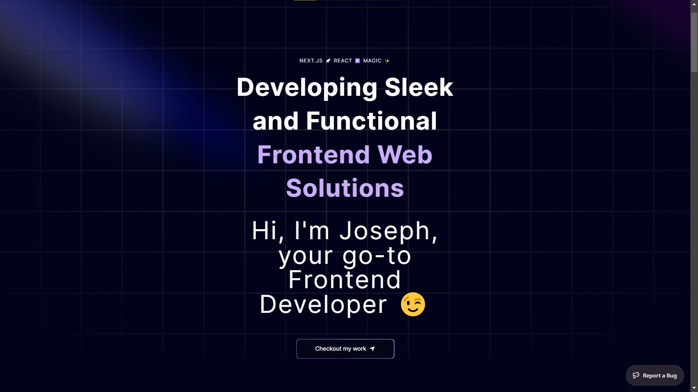

# 🌟 sejoqariz

Welcome to **sejoqariz** – a stunning portfolio built with modern web technologies for a sleek and visually appealing user experience.




## 🚀 Technologies Used

- **Next.js**: A powerful React framework for building server-rendered and statically generated web applications.
- **Tailwind CSS**: A utility-first CSS framework for rapid and custom design.
- **Framer Motion**: A popular library for adding smooth and performant animations to React applications.
- **[Acertenity UI](https://ui.aceternity.com/)**: A web development toolkit providing pre-built components and libraries for creating modern and visually appealing websites.
- **[Sentry](https://sentry.io/)**: An application performance monitoring and error tracking platform.

## 🎨 Resources

- **CSS Gradient**: [cssgradient.io](https://cssgradient.io) for creating beautiful background gradients.
- **SVG Repo**: [svgrepo.com](https://www.svgrepo.com) for downloading high-quality SVGs.

## ✨ Key Features

### Acertenity UI

Acertenity UI is a versatile toolkit providing a collection of pre-built components for streamlined web development. Key features include:

- **Pre-built Components**: Ready-made components like grids, cards, animations, buttons, forms, and navigation bars.
- **Framework Agnostic**: Compatible with popular frameworks like React, Next.js, and Tailwind CSS.
- **Faster Development**: Save time with pre-built components.
- **Consistent Design**: Ensure a cohesive look and feel.
- **Modern Aesthetics**: Focused on creating visually appealing websites.

### Sentry

Sentry helps developers monitor application performance and track errors. Key features include:

- **Error Tracking**: Capture detailed information about errors, including messages, stack traces, and user environments.
- **Performance Monitoring**: Gain insights into application performance and identify potential issues.
- **Alerts and Integrations**: Integrate with tools like Slack and Jira to keep teams informed.
- **Supports Various Platforms**: Works with web, mobile, backend, and data science projects.

### Framer Motion

Framer Motion enhances your React applications with smooth and performant animations. Key features include:

- **Declarative Animations**: Define animations with a clean and readable syntax.
- **Interactive Elements**: Add dynamic animations responding to user interactions.
- **Layout Animations**: Ensure visually smooth transitions during layout updates.
- **Performance-focused**: Optimize animations for smooth and responsive performance.
- **Rich Animation Features**: Supports springs, keyframes, and SVG path animations.

## 🛠️ Setup Instructions

Follow these steps to clone the repository, install dependencies, and run the project locally.

### Prerequisites

- Node.js and npm installed on your machine.

### Installation

1. **Clone the repository**:
    ```bash
    git clone https://github.com/your-username/sejoqariz.git
    cd sejoqariz
    ```

2. **Install dependencies**:
    ```bash
    npm install
    ```

3. **Run the development server**:
    ```bash
    npm run dev
    ```

4. **Open your browser** and navigate to `http://localhost:3000` to see the project in action.

## 📄 License

This project is licensed under the MIT License. See the [LICENSE](LICENSE) file for details.

## 💬 Contact

For any inquiries or feedback, feel free to reach out at [sejokarizz@gmail.com](mailto:sejokarizz@gmail.com).

---

Feel free to customize this README further to suit your specific needs. If you have any more details to add, let me know!